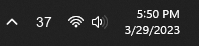
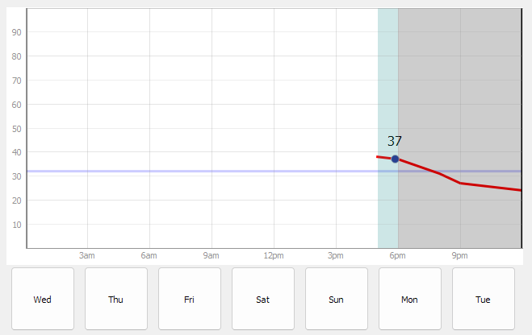
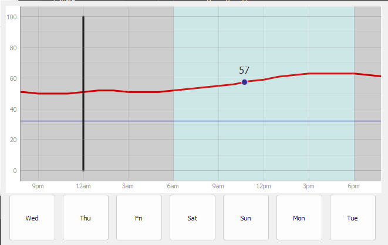
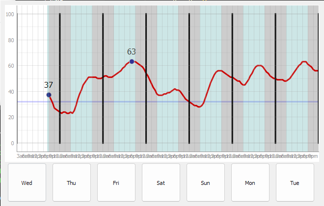

# Weather System Tray Icon 
### Made by Krzysztof Dutka

This uses Python3, QT5, and pyqtgraph to create a weather reporting app that lives in system tray icon in the lower right of the screen. The tray icon shows the current temperature and opens a larger window showing the temperature of the rest of the day when clicked. There is an option to close the application in the context menu (right click).

This uses 2 APIs and 3 calls, one to https://www.zipcodeapi.com to convert a zipcode to geo-coordinates, and 2 calls to https://api.weather.gov/ to get the weather at those coordinates. It automatically stores the geo-coordinates in a cache file for future uses.

The main window uses pyqtgraph to show the data. It has a point at the current time and temperature, with a blue background to signify daytime, and gray for nighttime according to https://api.weather.gov/. It is also possible to grab scroll upto 6 days ahead. For any time that you want to see the temperature, you can click and it will show it. Click on the same spot to hide.

There is also a week view with a button on the bottom left of the graph (not shown here). The buttons on the bottom will scroll and crop to that day on the graph

## WIP

